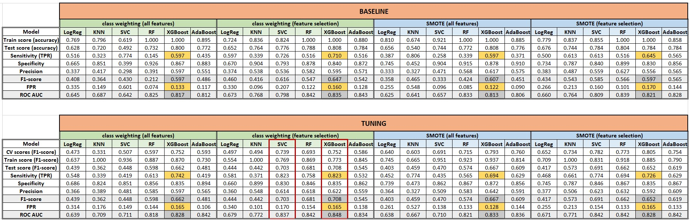

# Introduction
> *Insurance fraud is a deliberate deception perpetrated against or by an insurance company or agent for the purpose of financial gain [[1]](https://www.iii.org/article/background-on-insurance-fraud). Automobile insurance fraud involves conspiring to make false or exaggerated claims involving property damage or personal injuries following an accident. Some common examples include staged accidents where fraudsters purposely "arrange" for accidents to occur, the use of phantom passengers where people who were not even at the scene of the accident claim to have suffered grievous injury, duplicate claims for the same injury, and make false personal injury claims where personal injuries are grossly exaggerated*.

Fraudulent insurance claims contribute to between 5 and 10 percent of total claims and are costing insurance companies approximately 31 billion dollars annually, with these numbers rising [[2]](https://www.scirp.org/journal/paperinformation.aspx?paperid=94450). The detection of such claims is not an easy task. Moreover, a number of old-school methods have proven to be inefficient and costly. To overcome this issue, we can utilize machine learning model. Specifically, having a historical data of insurance claims which have labeled as fraudulent or not, we can use supervised machine learning model to detect fraudulent claims more easily.

*Note: the picture is for reference only*

## Objective
- To get some insights about the potential claims that are fraudulent.
- To build supervised machine learning models that can detect fraudulent claims in automobile insurance.

## Business value
- We could help the fraud analyst team to detect fraudulent claims more easily and efficiently, at least detecting the potential claims that are fraudulent.

## Methodology
- Exploratory Data Analysis.
- Fraud Detection using Supervised Machine Learning Model (Classification): Logistic Regression, KNN, SVM, Random Forest, XGBoost, and AdaBoost.

## Challenge
- The main challenge when building machine learning model for fraud detection is that the fraudulent claims are extremely rare to happen compared to legit claims (imbalanced class).

## The dataset
The dataset for this project is obtained via [Kaggle](https://www.kaggle.com/datasets/buntyshah/auto-insurance-claims-data) consisting of 1000 rows and 40 columns, i.e. 39 predictor variables and 1 response variable for labelling whether a claim is fraudulent or not. The data is about automobile incidents of policyholders from Ohio, Illinois, and Indiana states on 01 January 2015 to 01 March 2015. Here are some descriptions about the features:
- `age`: age in years of insured driver.
- `authorities_contacted`: type of authorities contacted such as Fire Department of Police.
- `auto_make`: brand of the auto vehicle.
- `auto_model`: model of the auto vehicle.
- `auto_year`: year the auto vehicle was made.
- `bodily_injuries`: severity of bodily injuries.
- `capital-gains`: data not defined by owner.
- `capital-loss`: data not defined by owner.
- `collision_type`: type of collision.
- `fraud_reported`: whether the claim is a fraud or not.
- `incident_city`: city of which incident occurred.
- `incident_date`: date of which incident occurred.
- `incident_hour_of_the_day`: hour of which incident occurred.
- `incident_location`: location of which incident occurred.
- `incident_severity`: severity of incident.
- `incident_state`: state of which incident occurred.
- `incident_type`: type of incident.
- `injury_claim`: injury claim amount.
- `insured_education_level`: insured driver's education level.
- `insured_hobbies`: insured driver's hobbies.
- `insured_occupation`: insured driver's occupation.
- `insured_relationship`: insured driver's relationship status.
- `insured_sex`: insured driver's sex.
- `insured_zip`: insured driver's zip code.
- `months_as_customer`: month as a customer to the insurer.
- `number_of_vehicles_involved`: number of vehicles involved in the incident.
- `police_report_available`: whether a police report is available or not.
- `policy_annual_premium`: annual premium of the policy.
- `policy_bind_date`: binding date of the policy.
- `policy_csl`: policy combined single limits scheme
- `policy_deductable`: deductible amount.
- `policy_number`: unique identifier each policy holder.
- `policy_state`: state of which policy was purchased.
- `property_claim`: property claim amount.
- `property_damage`: whether there were property damage or not.
- `total_claim_amount`: total claim amount.
- `umbrella_limit`: type of insurance add on rider to protect from excess liabilities.
- `vehicle_claim`: vehicle claim amount.
- `witnesses`: number of witnesses.
- `_c39`: invalid entry.

# Conclusions

1. We have used six machine learning models (i.e. Logistic Regression, KNN, SVM, Random Forest, XGBoost, and AdaBoost), two kind of dataset to be fed in machine learning models (i.e. "all features" dataset and "feature selection" dataset), and two different techniques to handle the imbalanced class data (i.e. "class weighting" and "SMOTE"). After evaluating all the possible models using different datasets and techniques to handle imbalanced class, we found that trained XGboost using "feature selection" dataset and "class weighting" technique has the best performance. It has `84.8%` ROC AUC score and `70.8%` F1-score.
2. Using "feature selection" dataset to train machine learning models would increase the model performances. This could happen because we have removed irrelevant features from the dataset which are not significant to predict output target.
3. The XGboost model tells us that `incident_severity` as the most important and impactful feature which gives a very high contribution to the output prediction based on the "The mean of absolute Shapley Values" (i.e. +1.24 log-odds or 0.775 probability) and then followed by `insured_hobbies_chess`, `insured_hobbies_cross-fit`, `total_claim_amount`, and `profit_or_loss` features. `incident_severity` also contributes the most as the splitter within XGBoost trees.
4. Using our best XGBoost model, we are able to minimize the total loss due to fraudulent claims by up to `83.56%` from the total expected loss and increase the time efficiency in evaluating and assessing claims by up to `67.2%`.

# Recommendations
The first question to ask when assessing and evaluating a claim is how is the incident severity occured. Most of the fraudulent claims come from "Major Damage" incident severity so we have to be aware of these incidents, perhaps most of the policyholders motive are to exaggerate their incident severity to gain more claim amount. 

Then followed by a question of what is the policyholder hobby. Chess players and cross-fitters are more prone of committing to fraud compared to other hobbies. For chess players, the fraud rate of "Trivial Damage" and "Minor Damage" are relatively very high whereas for cross-fitters, the fraud rate of "Minor Damage" and "Total Loss" are relatively high. These could be useful rules to flag some potential fraudulent claims.

For the region state, incidents that occur in "OH" state have the highest fraud rate whereas in "WV" state have the lowest fraud rate. We could flag "OH" state as the "red zone" of someone committing to fraud while "WV" as the "safe zone". But the one million dollar question to ask is, why does a hobby matter? Does a particular hobby lead someone to commit fraudulent claims? Or fraudster tend to like a particular hobby? This seems to be the most difficult question to answer.
